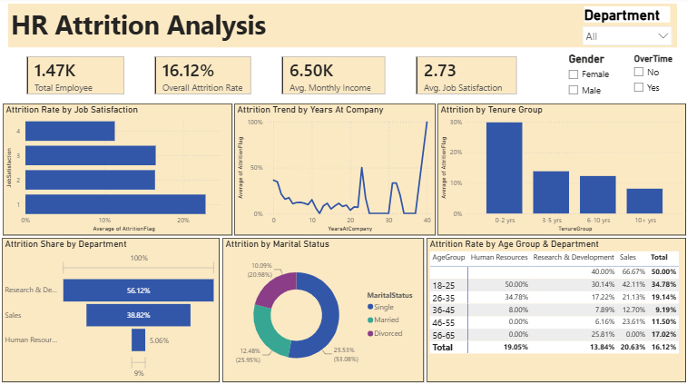

# HR Attrition Analysis Dashboard

Analyzed employee attrition using Python for feature engineering, Excel for data validation, and Power BI to build an interactive dashboard identifying key drivers of attrition.

## Tools Used
Python (Pandas), Excel, Power BI

## Key Insights
- Employees aged 18-25 had a 50% attrition rate, significantly higher than older age groups
- Sales department had the highest attrition rate (20.6%) among all departments
- Single employees accounted for ~53% of all attrition cases, compared to married and divorced employees

## Dataset
[IBM HR Analytics Employee Attrition Dataset (Kaggle)](https://www.kaggle.com/datasets/pavansubhasht/ibm-hr-analytics-attrition-dataset)
